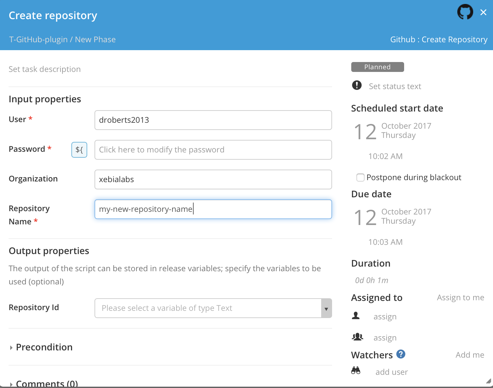
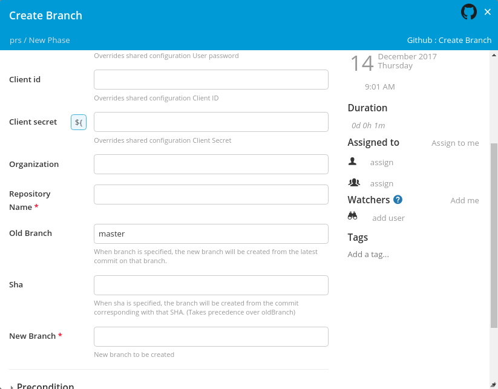
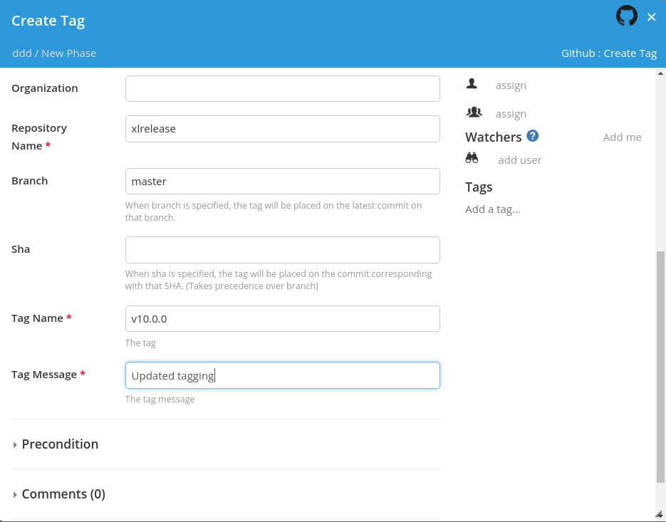
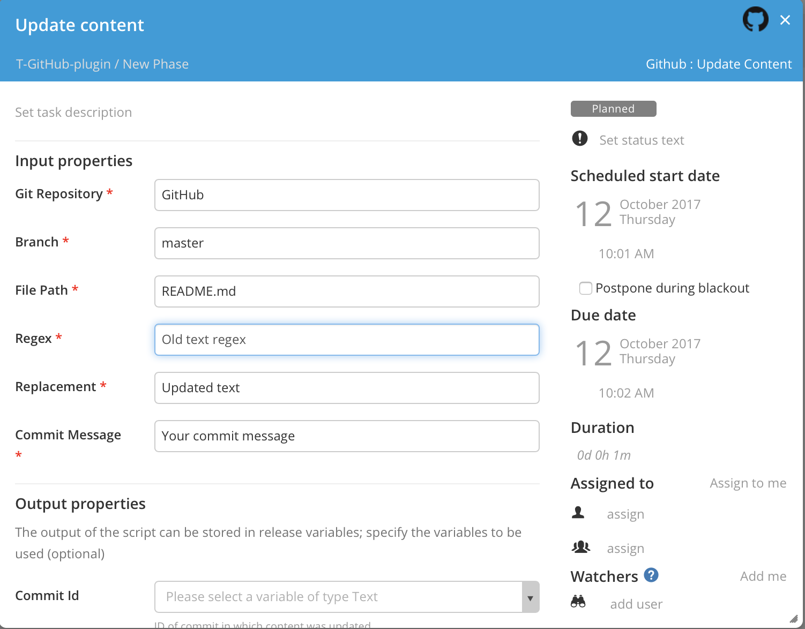
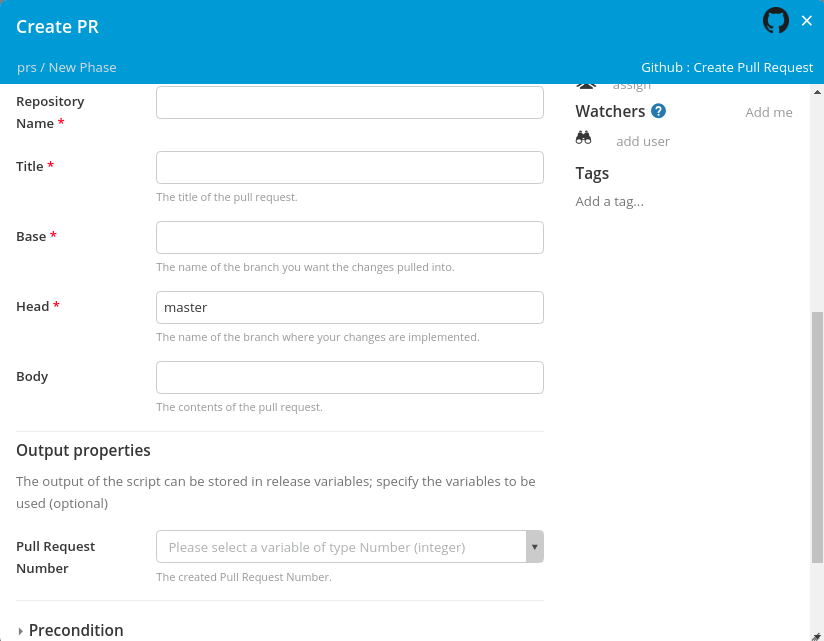
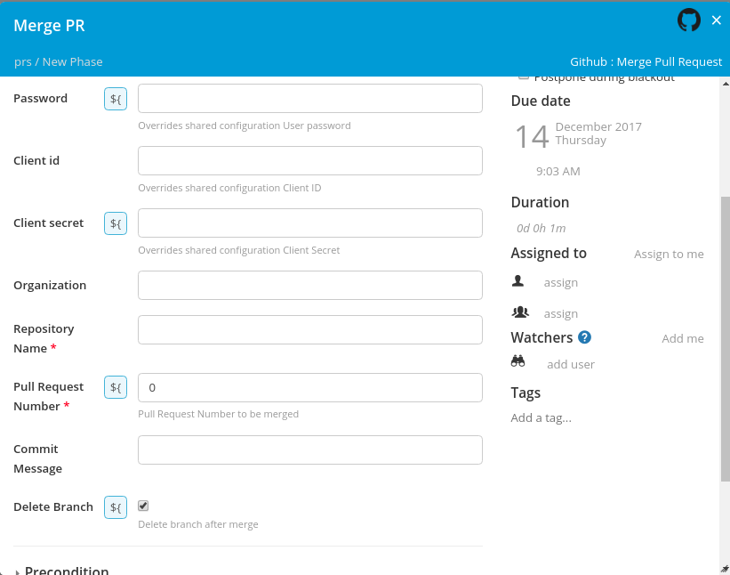
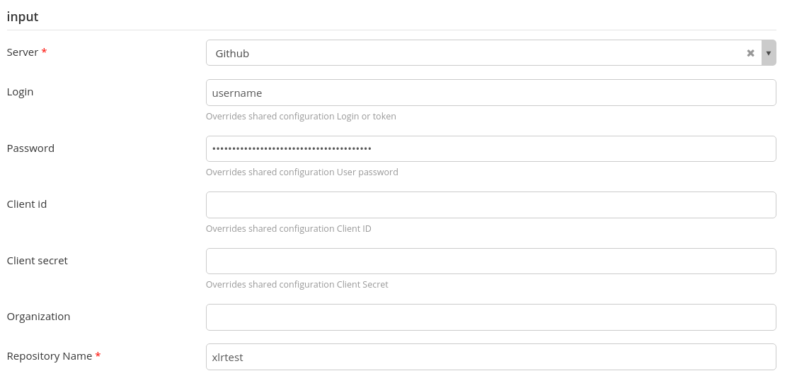
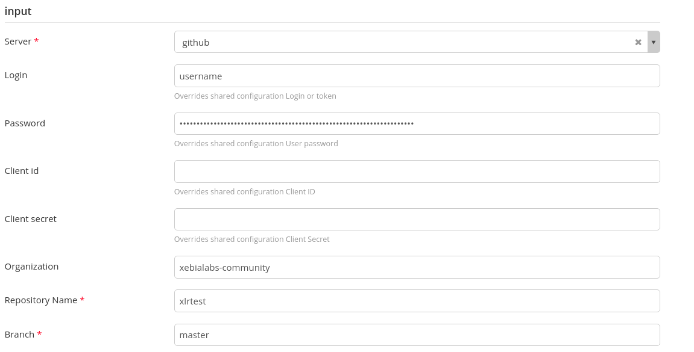

# XL Release GitHub Plugin #

[![Build Status][xlr-github-plugin-travis-image] ][xlr-github-plugin-travis-url]
[![Codacy][xlr-github-plugin-codacy-image] ][xlr-github-plugin-codacy-url]
[![Code Climate][xlr-github-plugin-code-climate-image] ][xlr-github-plugin-code-climate-url]
[![License: MIT][xlr-github-plugin-license-image] ][xlr-github-plugin-license-url]
[![Github All Releases][xlr-github-plugin-downloads-image] ]()

[xlr-github-plugin-travis-image]: https://travis-ci.org/xebialabs-community/xlr-github-plugin.svg?branch=master
[xlr-github-plugin-travis-url]: https://travis-ci.org/xebialabs-community/xlr-github-plugin
[xlr-github-plugin-codacy-image]: https://api.codacy.com/project/badge/Grade/d45f829ce3c1462a867f12ef06500865
[xlr-github-plugin-codacy-url]: https://www.codacy.com/app/joris-dewinne/xlr-github-plugin
[xlr-github-plugin-code-climate-image]: https://codeclimate.com/github/xebialabs-community/xlr-github-plugin/badges/gpa.svg
[xlr-github-plugin-code-climate-url]: https://codeclimate.com/github/xebialabs-community/xlr-github-plugin
[xlr-github-plugin-license-image]: https://img.shields.io/badge/License-MIT-yellow.svg
[xlr-github-plugin-license-url]: https://opensource.org/licenses/MIT
[xlr-github-plugin-downloads-image]: https://img.shields.io/github/downloads/xebialabs-community/xlr-github-plugin/total.svg

## Preface

This document describes the functionality provided by the XL Release GitHub plugin.

See the [XL Release reference manual](https://docs.xebialabs.com/xl-release) for background information on XL Release and release automation concepts.

## Overview

The `xlr-github-plugin` is an [XL Release](https://docs.xebialabs.com/xl-release/index.html) plugin that allows you to integrate with GitHub.

## Requirements

* **XL Release Server** 7+

## Installation

### Building

You can use the gradle wrapper to build the plugin.

```
./gradlew clean assemble

```

### Installing

To install this plugin you need to put the jar file into `XL_RELEASE_SERVER_HOME/plugins` and restart XL Release:

* `xlr-github-plugin-<version>.jar` (you can find it in `xlr-github-plugin/build/libs/` once you build it),

Restart the XL Release server after installing the JAR files.

## Configuration

Users can choose a variety of authentication methods, and based on the method chosen, a subset of the configuration fields will need to be filled out.  The most common approach would be using an authentication token in the "Login or token" field.  This token is generated within the GitHub GUI, and the defined scopes for the token should match up with what you intend to orchestrate through XL Release.  For the base url, the API version should be specified - something like https://github.example.com/api/v3 for GitHub Enterprise customers running on their own domain.  Client ID and Client Secret are fields for an alternative authentication method - these can be left blank in the case of token authentication.  

The User Agent, Per Page, and API Preview fields should be left at their default value for users getting started with the plugin.  These settings enable additional control over API calls.

## Usage 

### Create Repository task



### Create Branch task



### Create Tag task



### Update Content task



### Create Pull Request task



### Merge Pull Request task



### Pull Request Trigger



### Commit Trigger



## References

### Development

#### Releasing

This project uses the [nebula-release-plugin](https://github.com/nebula-plugins/nebula-release-plugin), which in turn uses [gradle-git plugin](https://github.com/ajoberstar/gradle-git). So you can release a new version if this project using following commands:

* to release a new patch (default): `./gradlew final -Prelease.scope=patch`
* to release a new minor release: `./gradlew final -Prelease.scope=minor`
* to release a new major release: `./gradlew final -Prelease.scope=major`

By default gradle uses the last tag created, so in order to bypass that include `-Prelease.useLastTag=false` in your gradle task.

By default when you build the project it builds a snapshot version of next (to be released) minor release. You can get rid of `-SNAPSHOT` in the version by adding command-line parameter `-Prelease.stage=final`. Note that your Git project must be clean to be able to set version to `final` stage.
